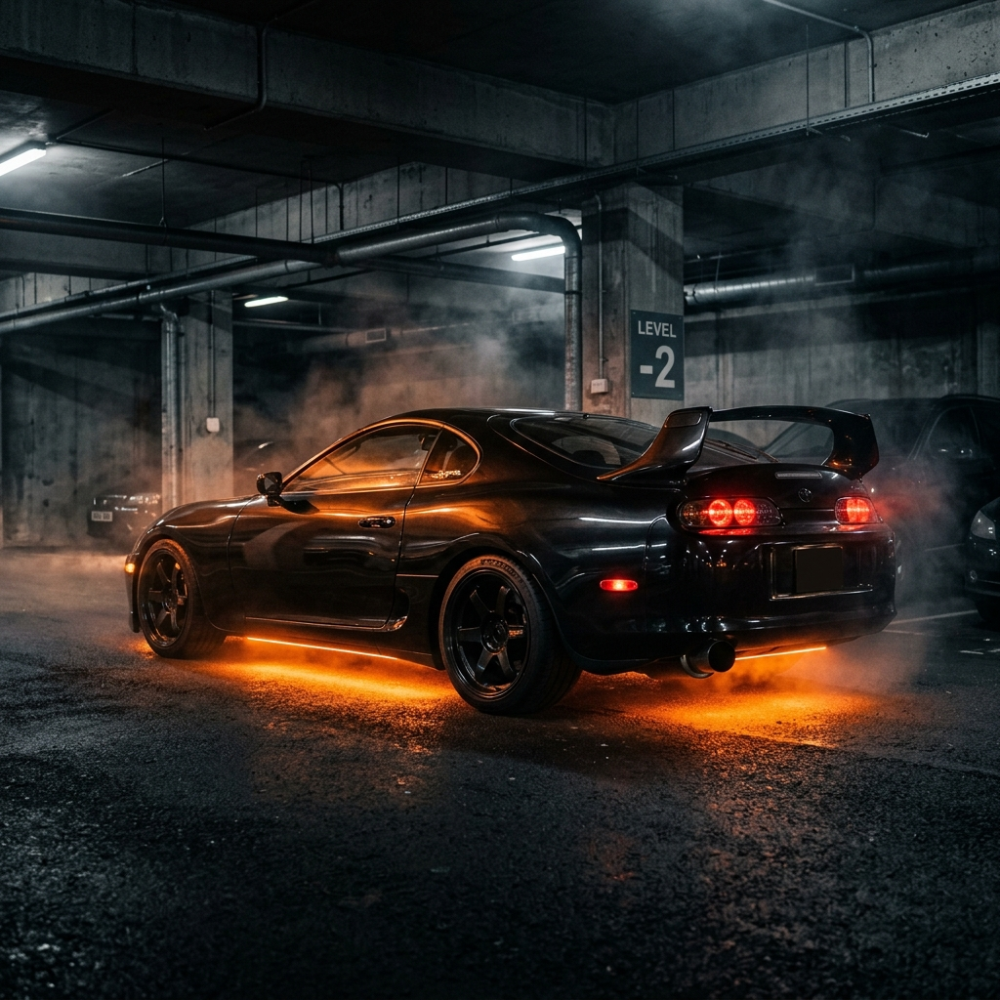

🏎️ PROJECT SUPRA // THE CINEMATIC PORTFOLIO

> "I build digital experiences that move — not just visually, but emotionally. Driven by animation, fueled by obsession, and wired for immersive design." — Hurman Ejaz



🏁 PHASE 1: IGNITION (The Vision)
This isn't just a portfolio; it's a high-performance machine. Inspired by the soul of the Toyota Supra MK4 and the atmospheric intensity of underground tuner culture, Project Supra was engineered to transform the traditional resume into a cinematic interaction experience.

Most websites are static showrooms. This is a journey through the garage of a creative developer, where code is the fuel and animation is the exhaust.

---

🛠️ THE ENGINE (Technical Specifications)
Under the hood, this machine is tuned for maximum FPS and seamless transitions.

- Chassis: [React 19](https://react.dev/) + [Vite](https://vitejs.dev/) (For ultra-fast cold starts and HMR)
- Aero/Visuals: [Tailwind CSS v4](https://tailwindcss.com/) (Streamlined utility styling)
- Drive Train: [GSAP](https://greensock.com/gsap/) + [ScrollTrigger](https://greensock.com/scrolltrigger/) (Precision scroll-linked animations)
- Transmission: [Lenis](https://lenis.darkroom.engineering/) (Buttery smooth cinematic scrolling)
- Interior: [Framer Motion](https://www.framer.com/motion/) (Interactive UI micro-animations)
- Turbocharger: [Three.js](https://threejs.org/) + [React Three Fiber](https://docs.pmnd.rs/react-three-fiber/) (3D Supra MK4 integration)

---

📟 TELEMETRY (Core Features)

1. Scroll-Driven Storytelling
The site behaves like a film. As you scroll, the camera pans through a 3D environment, revealing the developer’s identity, skills, and projects in a linear, cinematic narrative.

2. Custom HUD System
Every UI element is designed to feel like a high-tech dashboard. From the magnetic custom cursor to the telemetry-style skill tags, the interface is built for immersion.

3. Machine-Themed Projects
Projects aren't just listed; they are "installed." Each project (like the AI Quiz Generator) is presented as a performance module with detailed specs and cinematic mockups.

4. Dynamic Lighting Systems
The global gradient background and 3D fog systems react to the theme, shifting between a deep "Midnight Garage" dark mode and a high-visibility light mode.

---

🔧 ASSEMBLY (Installation)

To get this machine running in your local environment, follow the telemetry data below:

1. Clone the repository:
   ```bash
   git clone https://github.com/hurman11/Portfolio.git
   ```

2. Fuel up (Install dependencies):
   ```bash
   npm install
   ```

3. Ignition (Start dev server):
   ```bash
   npm run dev
   ```

4. Nitro (Build for production):
   ```bash
   npm run build
   ```

---

👤 THE PILOT (Hurman Ejaz)

Full Stack Developer // Creative Technologist

"Driven by animation. Wired for immersion."

- GitHub: [@hurman11](https://github.com/hurman11)
- LinkedIn: [Hurman Ejaz](https://www.linkedin.com/in/hurman-ejaz-75556b2b5)
- Email: hurmanejaz@gmail.com

---

📜 LOGBOOK
This project is an ongoing experiment in visual storytelling. New "Performance Modules" (Projects) are currently being built in the garage.

Signal Received. Connection Established. 📡
