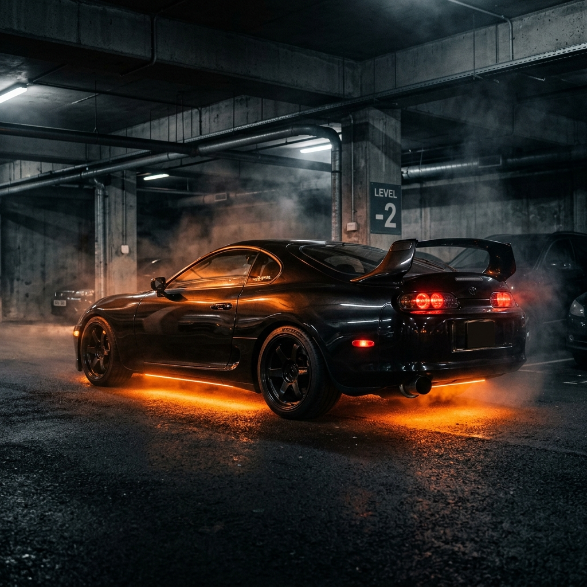

# 🏎️ PROJECT IGNITION // THE CINEMATIC 3D PORTFOLIO

> *"I build things that move. Not just visually — emotionally. Driven by animation. Obsessed with craft."* — **Hurman Ejaz**



---

## 🏁 VISION & CONCEPT

**Project Ignition** transforms the traditional developer portfolio into a high-octane, immersive WebGL experience. Inspired by underground tuner culture and engineered around a interactive **3D Toyota Supra MK4**, this site bridges spatial design, physical motion graphics, and full-stack engineering into a seamless digital journey.

---

## 🛠️ THE ENGINE (Technical Architecture)

Under the hood, **Project Ignition** is engineered for maximum 60FPS performance, fluid layout transitions, and responsive multi-device synergy:

- **Core Framework**: [React 19](https://react.dev/) + [Vite](https://vitejs.dev/) (Instant HMR & optimized production bundling)
- **Styling System**: [Tailwind CSS v4](https://tailwindcss.com/) + CSS Custom Token Variables (Dynamic theme adaptivity)
- **3D Graphics Engine**: [Three.js](https://threejs.org/) + [React Three Fiber](https://docs.pmnd.rs/react-three-fiber/) + [@react-three/drei](https://github.com/pmndrs/drei)
- **Scroll Synchronization**: [GSAP ScrollTrigger](https://greensock.com/scrolltrigger/) + [Lenis Scroll](https://lenis.darkroom.engineering/) (Cinematic camera timeline scrubbing)
- **Interactive Motion Physics**: [Framer Motion](https://www.framer.com/motion/) (Spring physics, kinetic typography, and 3D card tilt)

---

## 📟 CORE FEATURES & HIGHLIGHTS

### 1. 🏎️ 3D Supra Integration & Interactive Engine Rev
- **3D Model Scrubbing**: A fully detailed 3D Toyota Supra MK4 model centered seamlessly across all viewport sections (`IGNITION`, `ORIGIN`, `MACHINES`, `CONTACT`).
- **Interactive Engine Rev**: Pressing the `REV ENGINE` trigger fires a custom 3D event that vibrates the car chassis with physical engine jitter while blasting intense neon-orange exhaust flame illumination.

### 2. 💎 Optical Glass Physics (Reflection & Refraction)
- **Specular Glare Sheens**: Custom CSS pseudo-element light glare sheens applied to all cards (`.glass-card`, `.craft-card`, `.glass-panel`) and navigation HUD (`.glass-navbar`, `.glass-button`).
- **Inner Rim Refraction**: Dual-tone specular highlight borders simulating realistic optical light refraction through heavy frosted glass.

### 3. 🌓 Adaptive Dual Theme (Dark / Light Mode)
- **Radial Ambient Gradient**: Transitions from a deep "Midnight Garage" dark theme to a warm, sun-kissed amber/cream radial gradient in Light Mode.
- **Dynamic 3D Podium**: Automatically morphs the 3D floor platform into a crisp white metallic display podium in Light Mode.

### 4. 🔤 Kinetic Typography & 3D Tilt Craft Cards
- **Kinetic Letter Waves**: Individual letters in the hero title (`HURMAN EJAZ`) react to mouse velocity with elastic spring displacement and color ripples.
- **Perspective 3D Card Tilt**: Craft cards in the `ORIGIN` section react to mouse position with dynamic 3D spatial tilt angles (`rotateX/Y`).

### 5. 📱 Responsive Layout Synergy
- **Desktop Horizontal Snap**: Pinning scroll-track scrub with exact 33.3% section rounding snap physics.
- **Mobile Vertical Flow**: Smooth transition to natural vertical scrolling on screens under 768px with responsive 3D model camera framing.

---

## 🔧 ASSEMBLY (Installation & Local Setup)

To spin up Project Ignition locally:

1. **Clone the repository**:
   ```bash
   git clone https://github.com/hurman11/Project-Ignition.git
   ```

2. **Fuel up (Install dependencies)**:
   ```bash
   npm install
   ```

3. **Ignition (Start local dev server)**:
   ```bash
   npm run dev
   ```

4. **Nitro (Build production bundle)**:
   ```bash
   npm run build
   ```

---

## 👤 THE PILOT

**Hurman Ejaz**  
*Full Stack Developer // Creative Technologist*

- **GitHub**: [@hurman11](https://github.com/hurman11)
- **LinkedIn**: [Hurman Ejaz](https://www.linkedin.com/in/hurman-ejaz-75556b2b5)

---

*Signal Received. Engine Ignited. Connection Established. 📡*
